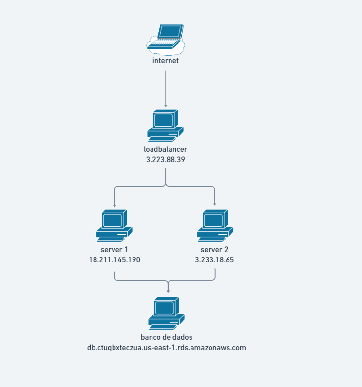

mysql -h db.ctuqbxteczua.us-east-1.rds.amazonaws.com -P 3306 -u admin -p 

loadbalancer: 3.223.88.39 
    server 1: 18.211.145.190 
    server 2: 3.233.18.65 
    database: db.ctuqbxteczua.us-east-1.rds.amazonaws.com 

ssh -i chave.pem ubuntu@3.223.88.39 
ssh -i chave.pem ubuntu@18.211.145.190 
ssh -i chave.pem ubuntu@3.233.18.65 

# apt-get install
apt-get update 
apt-get install php-fpm 
apt-get install mysql 
apt-get instal phpmysql 
apt-get install nginx 
apt-get install openvpn 
 
 

# openvpn
cd etc/openvpn 
nano server.conf 
cat server.conf > client.conf 
openvpn --genkey --secret chave 
systemctl stop openvpn 
opevpn --config server.conf 
opevpn --config client.conf 

